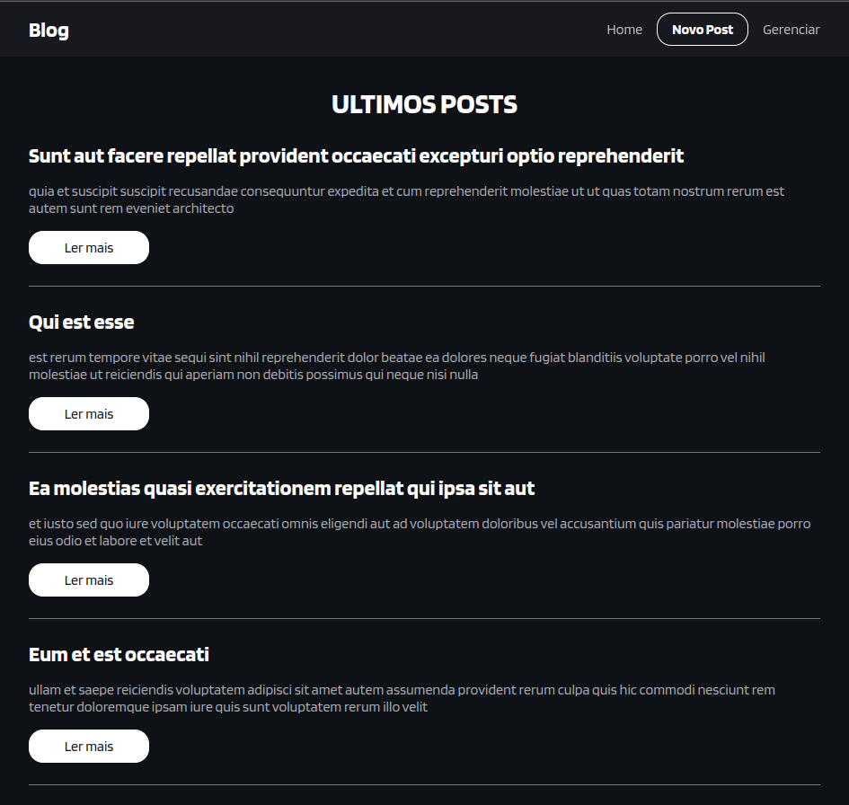
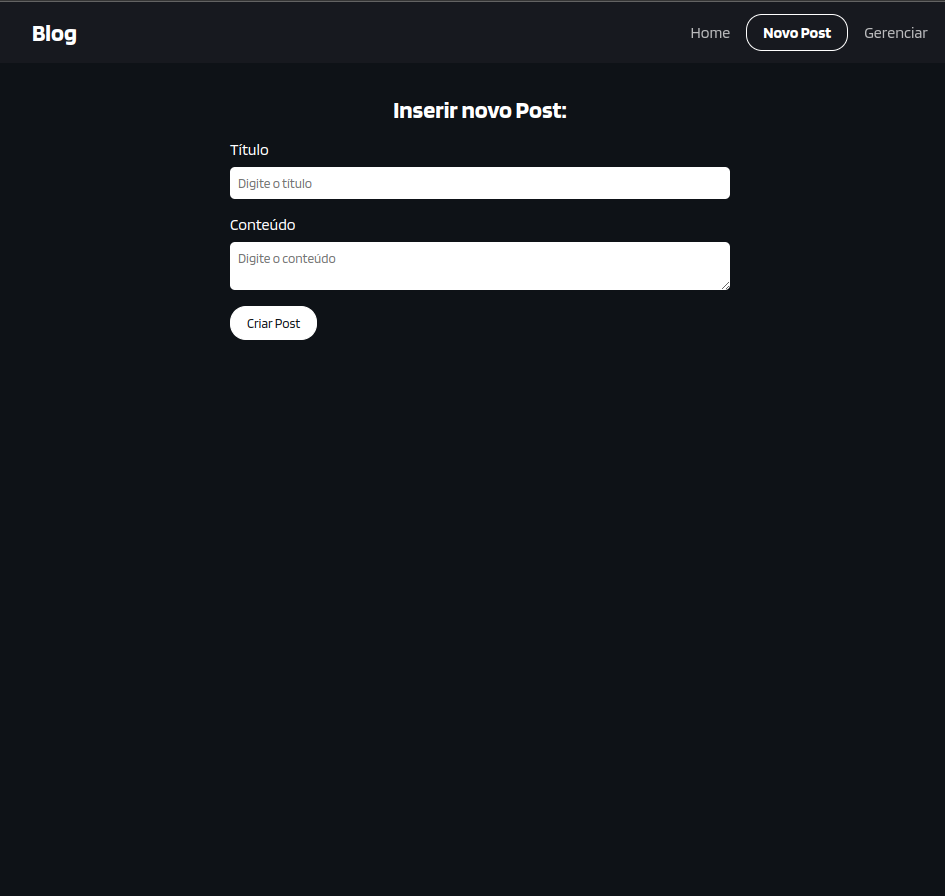
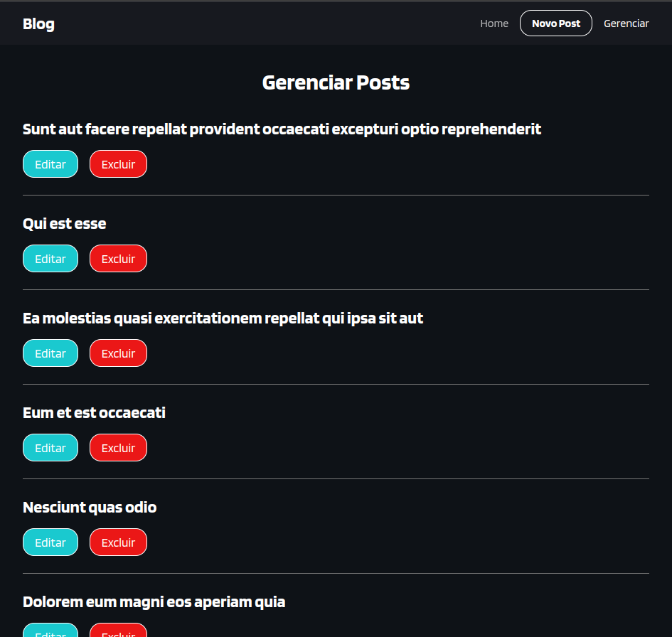
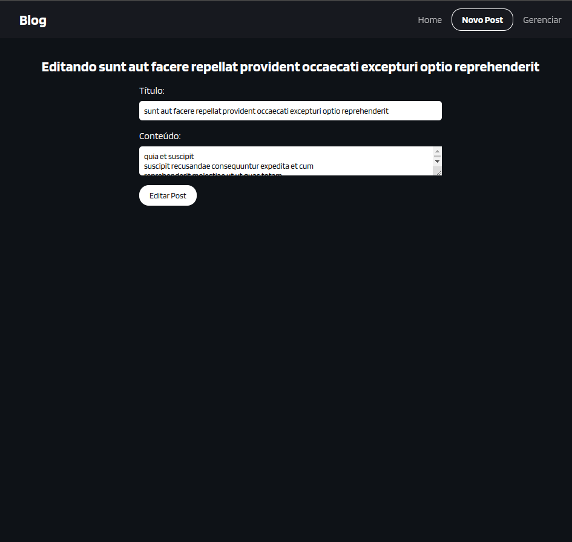

# Blog

🚀 **Blog** é um projeto desenvolvido como parte do curso #HoraDeCodar. Esta aplicação permite que os usuários leiam, escrevam e gerenciem artigos de blog, oferecendo uma plataforma simples e eficaz para compartilhar ideias e informações.

## Funcionalidades

- 📝 **Criação de Postagens**: Escreva e publique novos artigos no blog.
- 🖊️ **Edição de Postagens**: Edite artigos existentes para manter o conteúdo atualizado.
- 🗑️ **Exclusão de Postagens**: Exclua artigos que não são mais relevantes.
- 📖 **Leitura de Postagens**: Leia artigos publicados por outros usuários.

## Tecnologias Utilizadas

- **Frontend**: ReactJS
- **Estilo**: CSS
- **Requisições HTTP**: Axios
- **Dados**: JSON mockado

## Imagens






## Instalação e Uso

Para rodar o projeto localmente, siga os passos abaixo:

1. Clone o repositório (somente leitura):
   ```sh
   git clone https://github.com/JefsonOliveira/Blog.git
   ```
2. Navegue até o diretório do projeto:
   ```sh
   cd arquivos_blog
   ```
3. Instale as dependências:
   ```sh
   npm install
   ```
4. Inicie o servidor de desenvolvimento com Vite:
   ```sh
   npm run dev
   ```

O aplicativo estará disponível em `http://localhost:3000`.

## Contato

Para dúvidas ou mais informações, entre em contato:

- **Nome**: Jefson K Oliveira
- **Email**: kaironoliveira16@gmail.com
- **LinkedIn**: [Meu Perfil](https://www.linkedin.com/in/jefson-oliveira-a92a62206/)

